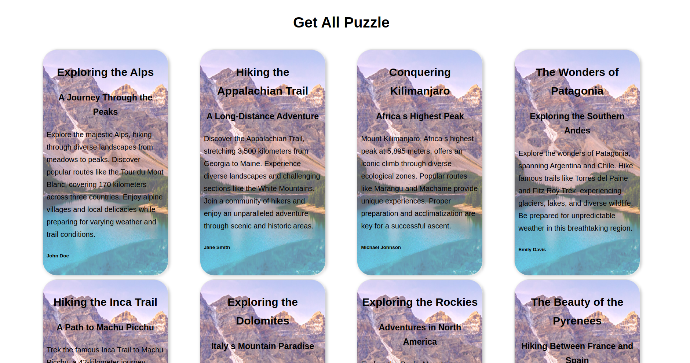

### L'objectif de ce puzzle est d'assembler l'ensemble des pièces du Puzzle pour réaliser l'interfae ci dessous

Pour remplir cet objectif, tu n'as pas besoin de coder la moindre chose. Ton objectif est de décortiquer la structure du projet pour y placer les bouts de code suivant. Chaque bout de code n'a qu'une seule place possible et tous les fichiers nécessaires sont en place
A toi de les comprendre et les intéger en copier-coller au bon endroit. Une fois intégrer dans le fichier, vérifies si certaines lignes ne sont pas à décommenter
Attention, Les bouts de code ne sont pas triès par ordre..

Si ce n'est pas déjà fait, penses à lire le Readme et configurer ton projet avant de te lancer.

### Liste des pièces du puzzle

# Piece 1

`create table montain (
  id int unsigned primary key auto_increment not null,
  title varchar(255) not null,
  subtitle varchar(255) not NULL,
  paragraph LongText not null,
  summary TEXT not null,
  author varchar(255) not null,
  image_src varchar(255),
  image_alt varchar(255),
  published_date DATE not null,
  modified_date DATE not null,
  keywords varchar(255)
);`

# Piece 2

`MontainCard.propTypes = {
  montain: PropTypes.shape({
    title: PropTypes.string.isRequired,
    subtitle: PropTypes.string.isRequired,
    summary: PropTypes.string.isRequired,
    author: PropTypes.string.isRequired,
  }).isRequired,
};`

# Piece 3

`{
    path: "",
    element: <App />,
    children: [
      {
        path: "/",
        element: <Montains />,
        loader: async () => {
          const montains = await connexion.get(
           `${import.meta.env.VITE_API_URL}/api/montains`          );
          return montains.data;
        },
      },
    ],
  },`

# Piece 4

`
const montains = require("./controllers/montains");

// Route to get a list of montains
router.get("/montains", montains.browse);
`

# Piece 5

`
import axios from "axios";

const instance = axios.create({
baseURL: import.meta.env.VITE_API_URL,
});

export default instance;

`

# Piece 6

`
const client = require("../../database/client");

const readAll = async () => {
// Execute the SQL SELECT query to retrieve all cars from the "car" table
const [montains] = await client.query(
`select id, title, subtitle, author, summary from montain`
);

// Return the array of cars
return montains;
};

module.exports = { readAll };
`

# Piece 7

`

<title>Get ALL Montains Puzzle</title>
`

# Piece 8

`const montains = useLoaderData();
  return (
    <section className="container">
      {montains.map((montain) => (
        <MontainCard montain={montain} key={montain.id} />
      ))}
    </section>
  );`

# Piece 9

`
const browse = async (req, res, next) => {
try {
// Fetch all montains from the database
const montains = await montainsModel.readAll();

    // Respond with the montains in JSON format
    res.status(200).json(montains);

} catch (err) {
// Pass any errors to the error-handling middleware
next(err);
}
};
`

# Piece 10

`function MontainCard({ montain }) {
  return (
    <article
      className="card"
      style={{ backgroundImage:`url(${montainImage})`}}
    >
      

        <h2>{montain.title}</h2>
        <h3>{montain.subtitle}</h3>
        
{montain.summary}

        <h6>{montain.author}</h6>
      

    </article>
  );
}`

# Piece 11

`
const cors = require("cors");

app.use(
cors({
origin: [
process.env.CLIENT_URL, // keep this one, after checking the value in`server/.env`",
],
})
);
`

# Piece 12

`
header,
footer {
text-align: center;
}

.container {
margin: 2rem 5rem;
display: flex;
flex-wrap: wrap;
gap: 0.5rem;
justify-content: space-around;
}
`

# Piece 13

`INSERT INTO montain (title, subtitle, paragraph, image_src, image_alt, summary, author, published_date, modified_date, keywords) VALUES
('Exploring the Alps', 'A Journey Through the Peaks',
'The Alps are a magnificent range of mountains that stretch across eight countries in Europe, offering some of the most breathtaking views and challenging hikes in the world. Hiking in the Alps means traversing diverse landscapes, from lush meadows filled with wildflowers to rugged, snow-capped peaks. One of the most popular routes is the Tour du Mont Blanc, which takes hikers around the highest mountain in the Alps. This trek covers approximately 170 kilometers and passes through France, Italy, and Switzerland. Along the way, hikers can enjoy stunning panoramas, charming alpine villages, and an array of local delicacies. Preparation is key for such a journey; ensuring you have the right gear, sufficient provisions, and a good understanding of the terrain is essential. Additionally, weather conditions in the Alps can change rapidly, so it is important to be prepared for all eventualities. Safety should always be a priority, and it is advisable to check weather forecasts and trail conditions before setting out each day. Whether you are an experienced hiker or a novice, the Alps offer a variety of trails suited to different skill levels. From short, leisurely walks to strenuous multi-day hikes, there is something for everyone in this stunning mountain range.',
'image_alps.jpg', 'A breathtaking view of the Alps',
'Explore the majestic Alps, hiking through diverse landscapes from meadows to peaks. Discover popular routes like the Tour du Mont Blanc, covering 170 kilometers across three countries. Enjoy alpine villages and local delicacies while preparing for varying weather and trail conditions.',
'John Doe', '2023-07-01', '2023-07-02', 'Alps, hiking, mountains, Tour du Mont Blanc, alpine villages'),
('Hiking the Appalachian Trail', 'A Long-Distance Adventure',
'The Appalachian Trail is one of the longest continuously marked footpaths in the world, stretching approximately 3,500 kilometers from Georgia to Maine in the United States. It passes through 14 states, showcasing the incredible diversity of the Eastern U.S. landscape. Hikers can experience everything from dense forests and rolling hills to rocky ridges and expansive valleys. One of the most challenging sections is the White Mountains in New Hampshire, where the trail ascends some of the highest peaks in the Northeast. The trail is maintained by a vast network of volunteers and offers numerous shelters and campsites along the way. Planning a hike on the Appalachian Trail requires careful preparation, including obtaining maps, ensuring you have adequate food and water supplies, and being prepared for varying weather conditions. Hikers often undertake this journey in sections, returning year after year to complete different parts of the trail. The sense of community among Appalachian Trail hikers is strong, with many forming lasting friendships and sharing experiences. Whether you aim to hike the entire trail or just a portion, the Appalachian Trail offers an unparalleled adventure through some of the most scenic and historic landscapes in the United States.',
'image_appalachian.jpg', 'A view of the Appalachian Trail',
'Discover the Appalachian Trail, stretching 3,500 kilometers from Georgia to Maine. Experience diverse landscapes and challenging sections like the White Mountains. Join a community of hikers and enjoy an unparalleled adventure through scenic and historic areas.',
'Jane Smith', '2023-07-03', '2023-07-04', 'Appalachian Trail, long-distance hiking, White Mountains, Eastern U.S. landscape'),
('Conquering Kilimanjaro', 'Africa s Highest Peak',
'Mount Kilimanjaro is the highest peak in Africa, standing at 5,895 meters. Located in Tanzania, it is one of the world’s most iconic and accessible high-altitude climbs. Kilimanjaro consists of three volcanic cones: Kibo, Mawenzi, and Shira. The most popular route to the summit is the Marangu Route, also known as the "Coca-Cola" route due to its relative ease and popularity. However, there are several other routes, such as the Machame, Lemosho, and Rongai, each offering unique experiences and challenges. Climbing Kilimanjaro is a non-technical trek, meaning it requires no special mountaineering skills, but it does demand good physical fitness and acclimatization to altitude. The journey takes hikers through five distinct ecological zones, from lush rainforest at the base to the arctic conditions at the summit. Along the way, hikers can witness the diverse flora and fauna that inhabit these zones, including colobus monkeys, elephants, and a variety of bird species. Reaching the summit at Uhuru Peak is a momentous achievement, offering stunning views of the surrounding landscape and a profound sense of accomplishment. Proper preparation, including physical training, packing the right gear, and allowing time for acclimatization, is essential for a successful ascent.',
'image_kilimanjaro.jpg', 'Mount Kilimanjaro, Tanzania',
'Mount Kilimanjaro, Africa s highest peak at 5,895 meters, offers an iconic climb through diverse ecological zones. Popular routes like Marangu and Machame provide unique experiences. Proper preparation and acclimatization are key for a successful ascent.',
'Michael Johnson', '2023-07-05', '2023-07-06', 'Kilimanjaro, high-altitude climbing, Tanzania, Marangu Route, ecological zones'),
('The Wonders of Patagonia', 'Exploring the Southern Andes',
'Patagonia, a region spanning the southern parts of Argentina and Chile, is renowned for its stunning landscapes and diverse wildlife. The Southern Andes form the backbone of this region, offering some of the most spectacular hiking trails in the world. One of the most famous hikes is the Torres del Paine Circuit, a challenging trek that takes about 8 to 10 days to complete. This route provides breathtaking views of glaciers, turquoise lakes, and the iconic granite towers that give the park its name. Patagonia’s weather can be unpredictable, with strong winds and sudden rainstorms, so it is important to be well-prepared. Besides Torres del Paine, there are other notable trails such as the Fitz Roy Trek in Argentina’s Los Glaciares National Park. This trek offers views of the majestic Fitz Roy massif and the surrounding glaciers. Wildlife enthusiasts will be delighted with the chance to spot guanacos, Andean condors, and even the elusive puma. Patagonia is also home to rich cultural history, with many indigenous communities and a legacy of explorers and pioneers. Whether you are an avid hiker or simply a lover of nature, Patagonia offers an unforgettable adventure.',
'image_patagonia.jpg', 'A stunning view of Patagonia',
'Explore the wonders of Patagonia, spanning Argentina and Chile. Hike famous trails like Torres del Paine and Fitz Roy Trek, experiencing glaciers, lakes, and diverse wildlife. Be prepared for unpredictable weather in this breathtaking region.',
'Emily Davis', '2023-07-07', '2023-07-08', 'Patagonia, Southern Andes, Torres del Paine, Fitz Roy Trek, wildlife'),
('Hiking the Inca Trail', 'A Path to Machu Picchu',
'The Inca Trail is one of the most famous trekking routes in the world, leading hikers through the Peruvian Andes to the ancient city of Machu Picchu. This historic trail spans about 42 kilometers and typically takes 4 days to complete. Along the way, hikers pass through diverse landscapes, including cloud forests, alpine tundra, and Incan ruins. The trail is renowned for its stunning scenery and the sense of walking in the footsteps of the ancient Incas. The final destination, Machu Picchu, is one of the New Seven Wonders of the World and offers breathtaking views and a profound sense of history. The Inca Trail is regulated to preserve its condition and limit the number of hikers, so permits must be obtained well in advance. Preparation for the Inca Trail includes physical training, acclimatization to the high altitude, and packing essentials such as proper footwear, clothing for varying weather conditions, and sufficient food and water. Many hikers consider the Inca Trail a spiritual journey, with its combination of natural beauty and historical significance making it a truly unique experience.',
'image_inca_trail.jpg', 'The Inca Trail leading to Machu Picchu',
'Trek the famous Inca Trail to Machu Picchu, a 42-kilometer journey through diverse Peruvian landscapes. Experience cloud forests, Incan ruins, and the awe-inspiring Machu Picchu. Proper preparation and obtaining permits in advance are essential.',
'Sarah Brown', '2023-07-09', '2023-07-10', 'Inca Trail, Machu Picchu, Peru, hiking, ancient Inca ruins'),
('Exploring the Dolomites', 'Italy s Mountain Paradise',
'The Dolomites, located in northeastern Italy, are a UNESCO World Heritage site known for their dramatic peaks and picturesque landscapes. This mountain range offers some of the best hiking opportunities in Europe, with trails that cater to all levels of experience. One of the most popular hikes is the Alta Via 1, a long-distance trek that takes about 10 days to complete and covers approximately 120 kilometers. This route passes through stunning alpine scenery, including verdant valleys, high mountain passes, and charming mountain huts where hikers can rest and enjoy local cuisine. The Dolomites are also famous for their unique geological formations, with towering limestone cliffs and spires creating a breathtaking backdrop. Hiking in the Dolomites allows visitors to explore a variety of ecosystems, from lush forests and alpine meadows to rocky crags and glaciers. Wildlife enthusiasts can spot marmots, chamois, and golden eagles among the diverse fauna of the region. The Dolomites are accessible year-round, with each season offering a different experience, from wildflower blooms in spring and summer to snow-covered peaks in winter. Proper preparation and awareness of trail conditions are important for a safe and enjoyable hike in this beautiful mountain paradise.',
'image_dolomites.jpg', 'The stunning peaks of the Dolomites',
'Discover the Dolomites, a UNESCO World Heritage site in Italy. Hike popular routes like Alta Via 1, experiencing dramatic peaks, verdant valleys, and unique geological formations. Enjoy diverse ecosystems and wildlife in this mountain paradise.',
'Anna Wilson', '2023-07-11', '2023-07-12', 'Dolomites, Italy, hiking, Alta Via 1, alpine scenery'),
('Exploring the Rockies', 'Adventures in North America',
'The Rocky Mountains, or Rockies, span over 4,800 kilometers from Canada to New Mexico in the United States. This vast mountain range offers countless hiking opportunities, from short day hikes to challenging multi-day treks. One of the most iconic trails is the Continental Divide Trail (CDT), which stretches for approximately 5,000 kilometers along the Rocky Mountain crest. This trail provides hikers with stunning vistas of rugged peaks, alpine lakes, and diverse wildlife. Hiking in the Rockies requires thorough preparation, including physical conditioning, understanding of the trail conditions, and proper gear. The weather can be unpredictable, with sudden storms and temperature changes, so hikers must be prepared for all scenarios. In addition to the CDT, there are numerous national parks within the Rockies, such as Rocky Mountain National Park in Colorado and Banff National Park in Canada. These parks offer well-maintained trails and a variety of amenities for hikers. Wildlife sightings are common, with animals such as elk, moose, and bears inhabiting the region. Hiking in the Rockies is a rewarding experience, offering both natural beauty and a sense of adventure for those who take on its trails.',
'image_rockies.jpg', 'The majestic Rocky Mountains',
'Explore the Rocky Mountains, spanning from Canada to New Mexico. Hike the Continental Divide Trail or visit national parks like Rocky Mountain and Banff. Prepare for diverse weather and enjoy stunning vistas and wildlife sightings.',
'David Miller', '2023-07-13', '2023-07-14', 'Rocky Mountains, Continental Divide Trail, national parks, hiking, wildlife'),
('The Beauty of the Pyrenees', 'Hiking Between France and Spain',
'The Pyrenees mountain range forms a natural border between France and Spain, offering a mix of beautiful landscapes and rich cultural heritage. One of the most popular hiking routes is the GR10, a long-distance trail that traverses the entire French side of the Pyrenees. This challenging trail covers approximately 850 kilometers and takes about 45 days to complete. The GR10 offers hikers stunning views of snow-capped peaks, deep valleys, and picturesque villages. In addition to the GR10, there is the HRP (Haute Randonnée Pyrénéenne), which follows the border more closely and offers a more rugged and high-altitude experience. Preparation is crucial for hiking in the Pyrenees, as the terrain can be demanding and weather conditions variable. Hikers should be equipped with proper gear, sufficient food and water, and a good understanding of the route. The Pyrenees are also known for their biodiversity, with a variety of flora and fauna, including the rare Pyrenean chamois and griffon vultures. Whether you choose the GR10, HRP, or one of the many shorter trails, hiking in the Pyrenees offers an unforgettable adventure through a diverse and stunning landscape.',
'image_pyrenees.jpg', 'The scenic Pyrenees mountains',
'Discover the Pyrenees, a mountain range between France and Spain. Hike the GR10 or HRP trails for stunning views and challenging terrain. Experience rich biodiversity and cultural heritage in this beautiful region.',
'Laura Garcia', '2023-07-15', '2023-07-16', 'Pyrenees, GR10, HRP, hiking, France, Spain'),
('Hiking the Himalayas', 'The Roof of the World',
'The Himalayas, home to the world’s highest peaks, offer some of the most challenging and rewarding hikes on the planet. This mountain range spans five countries: Bhutan, China, India, Nepal, and Pakistan. Among the most famous trekking routes is the Everest Base Camp trek, which takes hikers to the base of the world’s highest mountain. This trek typically takes about 12-14 days and offers breathtaking views of Mount Everest and the surrounding peaks. Another popular route is the Annapurna Circuit, a diverse trek that takes about 15-20 days to complete and covers a range of landscapes, from subtropical forests to alpine meadows. Hiking in the Himalayas requires thorough preparation, including physical training, acclimatization to high altitudes, and packing the right gear. The weather can be harsh and unpredictable, so hikers must be prepared for a variety of conditions. The Himalayas are not only known for their natural beauty but also for their rich cultural heritage, with many monasteries, temples, and traditional villages along the trekking routes. Whether you are trekking to Everest Base Camp or exploring the Annapurna Circuit, hiking in the Himalayas is an unforgettable experience that combines stunning scenery with cultural immersion.',
'image_himalayas.jpg', 'The towering peaks of the Himalayas',
'Trek the Himalayas, home to the world’s highest peaks. Hike routes like Everest Base Camp and Annapurna Circuit for breathtaking views and cultural immersion. Proper preparation and acclimatization are essential for these challenging treks.',
'Alex Patel', '2023-07-17', '2023-07-18', 'Himalayas, Everest Base Camp, Annapurna Circuit, high-altitude hiking, cultural heritage'),
('The Majesty of the Andes', 'South America s Spine',
'The Andes, the longest mountain range in the world, stretch along the western coast of South America, spanning seven countries: Venezuela, Colombia, Ecuador, Peru, Bolivia, Chile, and Argentina. This diverse range offers a variety of hiking experiences, from the tropical cloud forests of Colombia to the arid deserts of Chile. One of the most famous treks in the Andes is the Huayna Potosi climb in Bolivia, which takes hikers to a summit over 6,000 meters high. Another popular hike is the Santa Cruz Trek in Peru’s Cordillera Blanca, known for its stunning glacial scenery. The Andes are also home to numerous cultural landmarks, including ancient Incan ruins and vibrant indigenous communities. Hiking in the Andes requires careful planning and preparation, including acclimatization to high altitudes, understanding the local weather patterns, and packing appropriate gear. The region’s biodiversity is astounding, with unique flora and fauna adapted to the varying climates. Whether you are climbing high peaks or exploring lush valleys, the Andes offer an unparalleled adventure that combines natural beauty with rich cultural history.',
'image_andes.jpg', 'The vast Andes mountain range',
'Explore the Andes, the longest mountain range in the world. Hike routes like Huayna Potosi and Santa Cruz Trek for diverse landscapes and cultural landmarks. Prepare for high altitudes and varying climates in this stunning region.',
'Maria Lopez', '2023-07-19', '2023-07-20', 'Andes, Huayna Potosi, Santa Cruz Trek, South America, Incan ruins'),
('Hiking in the Sierra Nevada', 'California s Majestic Mountains',
'The Sierra Nevada mountain range, located in California and Nevada, is known for its stunning granite peaks, alpine lakes, and diverse ecosystems. One of the most famous hiking trails in the Sierra Nevada is the John Muir Trail (JMT), which stretches for about 340 kilometers from Yosemite Valley to Mount Whitney, the highest peak in the contiguous United States. This trail offers hikers breathtaking views of rugged mountains, pristine lakes, and beautiful meadows. Another popular destination is Lake Tahoe, a large freshwater lake that straddles the border of California and Nevada. The Tahoe Rim Trail, a 270-kilometer loop around the lake, provides stunning views and a variety of terrain. Hiking in the Sierra Nevada requires preparation, including physical conditioning, understanding trail conditions, and packing appropriate gear. The weather can vary significantly, so hikers should be prepared for a range of temperatures and conditions. The Sierra Nevada is also home to diverse wildlife, including black bears, mule deer, and a variety of bird species. Whether you are tackling the JMT or exploring the Tahoe Rim Trail, hiking in the Sierra Nevada offers an unforgettable adventure through some of the most beautiful landscapes in the United States.',
'image_sierra_nevada.jpg', 'The granite peaks of the Sierra Nevada',
'Hike the Sierra Nevada, home to trails like the John Muir Trail and Tahoe Rim Trail. Experience stunning granite peaks, alpine lakes, and diverse ecosystems. Proper preparation and gear are essential for these beautiful and varied hikes.',
'Chris Johnson', '2023-07-21', '2023-07-22', 'Sierra Nevada, John Muir Trail, Tahoe Rim Trail, California, hiking'),
('Discovering the Scottish Highlands', 'A Journey Through History',
'The Scottish Highlands, known for their rugged beauty and rich history, offer some of the most scenic and atmospheric hiking trails in the United Kingdom. One of the most famous trails is the West Highland Way, a 154-kilometer route that takes hikers from the outskirts of Glasgow to Fort William. This trail passes through diverse landscapes, including rolling hills, lochs, and moorlands. Another notable hike is the ascent of Ben Nevis, the highest peak in the British Isles, which offers stunning views of the surrounding countryside. Hiking in the Scottish Highlands requires preparation, as the weather can be unpredictable and the terrain challenging. Hikers should be equipped with proper clothing, footwear, and navigation tools. The Highlands are also rich in wildlife, with red deer, golden eagles, and otters among the species that can be spotted. In addition to natural beauty, the Scottish Highlands are steeped in history, with ancient castles, battlefields, and historic sites along the trails. Whether you are walking the West Highland Way or climbing Ben Nevis, hiking in the Scottish Highlands offers a unique blend of natural beauty and historical significance.',
'image_scottish_highlands.jpg', 'The scenic Scottish Highlands',
'Explore the Scottish Highlands, hiking trails like the West Highland Way and Ben Nevis. Experience diverse landscapes, rich wildlife, and historical sites. Proper preparation is essential for these scenic and atmospheric hikes.',
'Fiona MacDonald', '2023-07-23', '2023-07-24', 'Scottish Highlands, West Highland Way, Ben Nevis, hiking, history'),
('Trekking in the Carpathians', 'Eastern Europe s Hidden Gem',
'The Carpathian Mountains, stretching across Central and Eastern Europe, offer a wealth of hiking opportunities in a region known for its untouched natural beauty and rich cultural heritage. This mountain range spans several countries, including Slovakia, Poland, Ukraine, Romania, and Hungary. One of the most popular hiking destinations is the High Tatras in Slovakia, known for their rugged peaks and scenic valleys. Another notable trek is the Făgăraș Mountains in Romania, home to the highest peaks in the country and the iconic Transfăgărășan road. Hiking in the Carpathians requires preparation, including understanding the trail conditions, packing appropriate gear, and being aware of local wildlife, such as bears and wolves. The region’s biodiversity is remarkable, with unique flora and fauna adapted to the varied climates and altitudes. In addition to natural beauty, the Carpathians are steeped in folklore and history, with traditional villages, medieval castles, and historic landmarks along the trails. Whether you are exploring the High Tatras or trekking through the Făgăraș Mountains, hiking in the Carpathians offers an unforgettable adventure in one of Europe’s most picturesque and culturally rich regions.',
'image_carpathians.jpg', 'The rugged Carpathian Mountains',
'Trek the Carpathians, spanning several countries in Eastern Europe. Hike destinations like the High Tatras and Făgăraș Mountains for stunning peaks and rich cultural heritage. Prepare for diverse conditions and unique wildlife in this hidden gem.',
'Andrei Petrescu', '2023-07-25', '2023-07-26', 'Carpathians, High Tatras, Făgăraș Mountains, hiking, Eastern Europe');`

# Piece 14

`
.card {
border: 1px solid lightgrey;
box-shadow: 2px 2px 5px 2px lightgrey;
width: 20%;
border-radius: 2rem;

background-position: 50% 50%;
div {
padding: 0.5rem;
background-color: rgba(255, 255, 255, 0.4);
height: 100%;
}

h2,
h3 {
text-align: center;
}
}
`

Bon courage !!!
